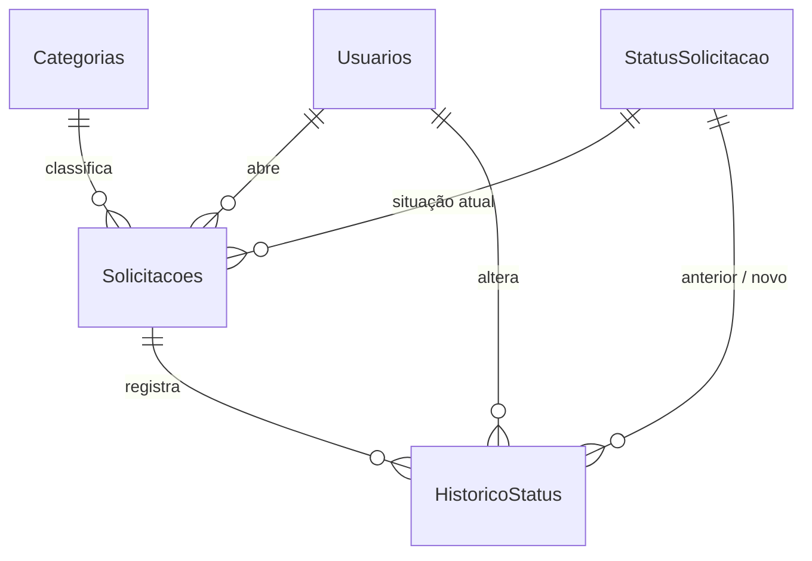

# Dicionário de Dados

Banco: **PortalSolicitacoes** (Microsoft SQL Server 2014+).
Scripts: [`database/01_schema.sql`](../database/01_schema.sql) (estrutura) e [`database/02_seed.sql`](../database/02_seed.sql) (dados iniciais).

## Diagrama

---

## Usuarios

Usuários que acessam o sistema.

| Coluna | Tipo | Nulo | Padrão | Descrição |
|---|---|---|---|---|
| **Id** | INT IDENTITY | Não | auto | Chave primária |
| Nome | NVARCHAR(100) | Não | | Nome de exibição |
| Login | VARCHAR(50) | Não | | Usuário de acesso. **Único** (`UQ_Usuarios_Login`) |
| SenhaHash | VARCHAR(100) | Não | | Hash bcrypt da senha (nunca a senha em texto) |
| Perfil | VARCHAR(20) | Não | `'SOLICITANTE'` | `SOLICITANTE`, `ATENDENTE` ou `ADMINISTRADOR` (`CK_Usuarios_Perfil`) |
| Ativo | BIT | Não | `1` | Usuários inativos não conseguem entrar |
| DataCriacao | DATETIME2(0) | Não | `SYSDATETIME()` | Data de cadastro |

## Categorias

Tipos de demanda. Tabela em vez de texto fixo para permitir novas categorias sem alterar código.

| Coluna | Tipo | Nulo | Padrão | Descrição |
|---|---|---|---|---|
| **Id** | INT IDENTITY | Não | auto | Chave primária |
| Nome | NVARCHAR(50) | Não | | Nome da categoria. **Único** |

Valores iniciais: TI, RH, Compras, Financeiro, Infraestrutura.

## StatusSolicitacao

Domínio fixo dos status. O `Id` é definido manualmente porque o código referencia esses valores (`src/constants.js`).

| Coluna | Tipo | Nulo | Padrão | Descrição |
|---|---|---|---|---|
| **Id** | TINYINT | Não | | Chave primária |
| Nome | NVARCHAR(30) | Não | | Nome do status. **Único** |

| Id | Nome |
|---|---|
| 1 | Aberto |
| 2 | Em Atendimento |
| 3 | Concluído |

## Solicitacoes

Demandas registradas pelos colaboradores.

| Coluna | Tipo | Nulo | Padrão | Descrição |
|---|---|---|---|---|
| **Id** | INT IDENTITY | Não | auto | Chave primária. Exibido como “código” (`#0001`) |
| Titulo | NVARCHAR(150) | Não | | Título (3 a 150 caracteres) |
| Descricao | NVARCHAR(2000) | Não | | Descrição (5 a 2000 caracteres) |
| CategoriaId | INT | Não | | FK → `Categorias.Id` |
| StatusId | TINYINT | Não | `1` (Aberto) | FK → `StatusSolicitacao.Id` |
| UsuarioId | INT | Não | | FK → `Usuarios.Id`. Solicitante, preenchido pela sessão |
| DataCriacao | DATETIME2(0) | Não | `SYSDATETIME()` | Data de abertura, preenchida pelo banco |
| DataAtualizacao | DATETIME2(0) | Sim | | Última edição ou mudança de status |

Índices: `IX_Solicitacoes_DataCriacao`, `IX_Solicitacoes_Status` e `IX_Solicitacoes_Categoria`, que atendem aos filtros da listagem.

## HistoricoStatus

Trilha de auditoria: uma linha na criação e uma a cada mudança de status.

| Coluna | Tipo | Nulo | Padrão | Descrição |
|---|---|---|---|---|
| **Id** | INT IDENTITY | Não | auto | Chave primária |
| SolicitacaoId | INT | Não | | FK → `Solicitacoes.Id` (**ON DELETE CASCADE**) |
| StatusAnteriorId | TINYINT | Sim | | FK → `StatusSolicitacao.Id`. `NULL` no registro de criação |
| StatusNovoId | TINYINT | Não | | FK → `StatusSolicitacao.Id` |
| UsuarioId | INT | Não | | FK → `Usuarios.Id`. Quem fez a alteração |
| DataAlteracao | DATETIME2(0) | Não | `SYSDATETIME()` | Momento da alteração |

Índice: `IX_HistoricoStatus_Solicitacao`.

---

## Convenções

- Tabelas e colunas em **PascalCase**, em português, com nomes no plural para entidades (`Solicitacoes`) e no singular para domínios (`StatusSolicitacao`).
- Restrições nomeadas explicitamente: `PK_`, `FK_`, `UQ_`, `CK_`, `DF_`, `IX_`.
- `NVARCHAR` para textos digitados pelo usuário (acentuação); `VARCHAR` para login e hash (ASCII).
- Datas em `DATETIME2(0)`: precisão de segundos, horário local do servidor.
